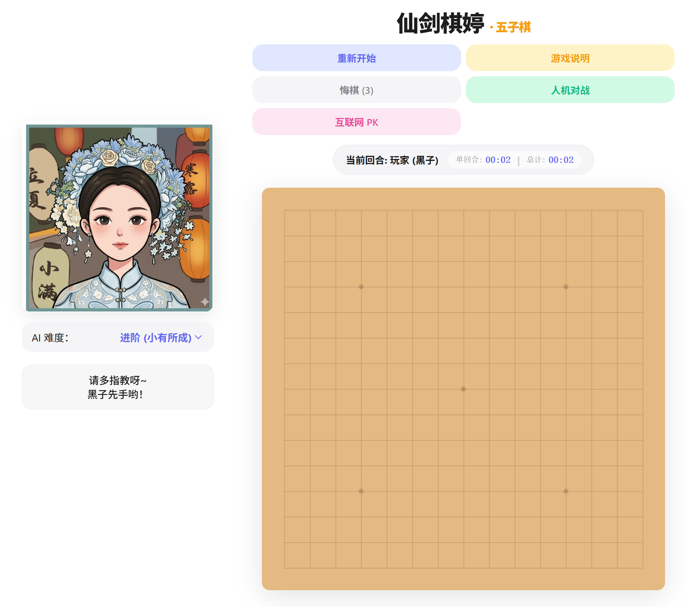

# 仙剑棋婷 · 五子棋 (Gomoku)

一个具有中国风特色的五子棋游戏，与可爱的AI角色"婷婷"进行人机对战，或通过互联网与好友PK！

---

## 🎮 游戏特色 (Features)

- **人机对战**: 与AI角色"婷婷"对战，支持三种难度等级
- **互联网PK**: 与好友通过链接联机对战
- **中国风UI**: 古典风格的棋盘和可爱的角色形象
- **实时计时器**: 显示单回合时间和总游戏时间
- **悔棋功能**: 每局可悔棋3次
- **角色互动**: 点击角色图片触发可爱对话

---

## 📖 游戏玩法 (How to Play)

### 基本规则 (Basic Rules)
1. **游戏类型**: 经典五子棋 (Gomoku)
2. **胜利条件**: 黑白双方交替落子，先在横、竖、斜任一方向连成五子者获胜
3. **角色设定**: 玩家执黑子先行，对手是可爱的婷婷
4. **操作方式**: 直接点击棋盘交叉点即可落子

### 难度等级 (Difficulty Levels)
- **新手 (婷婷学步)**: 适合初学者
- **进阶 (小有所成)**: 有一定挑战性
- **大师 (仙剑奇侠)**: 高手级别

---

## 🚀 快速开始 (Quick Start)

### 在线体验 (Online Demo)
直接访问 [GitHub Pages](https://pumatlarge.github.io/cuting-gumoku-game/) 即可开始游戏！

### 本地运行 (Run Locally)
```bash
# 克隆仓库
git clone https://github.com/Pumatlarge/cuting-gumoku-game.git

# 进入目录
cd cuting-gumoku-game

# 使用浏览器打开
# 方法1: 使用 Python (推荐)
python -m http.server 8000
# 然后访问 http://localhost:8000

# 方法2: 直接双击 index.html 文件
```

---

## 🎯 游戏截图 (Screenshots)



---

## 🛠️ 技术栈 (Tech Stack)

- **HTML5 Canvas**: 棋盘绘制
- **JavaScript (ES6+)**: 游戏逻辑
- **CSS3**: 样式设计
- **MQTT**: 联机对战功能

---

## 📁 项目结构 (Project Structure)

```
├── index.html               # 主页面
├── README.md                # 项目说明
├── src/                     # 源代码
│   ├── ai.js                # AI 算法
│   ├── game.js              # 游戏主逻辑
│   └── network.js           # 网络通信
└── assets/                  # 静态资源
    ├── images/              # 图片资源
    │   ├── ScreenShot.png   # 游戏截图
    │   ├── referee.png      # 角色图片(默认)
    │   ├── referee1.jpg     # 角色图片(害羞)
    │   ├── referee2.jpg     # 角色图片(生气)
    │   ├── referee3.jpg     # 角色图片(开心)
    │   ├── referee_normal.png   # 角色图片(正常)
    │   ├── referee_happy.png    # 角色图片(胜利)
    │   ├── referee_sad.png      # 角色图片(失败)
    │   ├── referee_angry.png    # 角色图片(生气)
    │   └── referee_thinking.png # 角色图片(思考)
    └── styles/              # 样式文件
        └── style.css        # 主样式
```

---

## 📜 许可证 (License)

MIT License

---

## 🤝 贡献 (Contributing)

欢迎提交 Issue 和 Pull Request！

---

---

# Xianjian Qiting · Gomoku

A Gomoku (Five in a Row) game with Chinese style, featuring a cute AI character "Tingting" for single-player mode, or play online with friends!

---

## 🎮 Features

- **AI Mode**: Play against the cute AI character "Tingting" with 3 difficulty levels
- **Online Multiplayer**: Play with friends via shared link
- **Chinese Style UI**: Classical board design with cute character
- **Real-time Timer**: Track turn time and total game time
- **Undo Function**: 3 undo chances per game
- **Character Interaction**: Click the character for cute responses

---

## 📖 How to Play

### Basic Rules
1. **Game Type**: Classic Gomoku (Five in a Row)
2. **Win Condition**: Players alternate placing stones. First to get 5 in a row (horizontally, vertically, or diagonally) wins
3. **Roles**: Player uses black stones (goes first), opponent is Tingting
4. **Controls**: Click on the intersection points to place a stone

### Difficulty Levels
- **Beginner**: Easy mode for new players
- **Intermediate**: Moderate challenge
- **Master**: Advanced AI for experienced players

---

## 🚀 Quick Start

### Online Demo
Download the zip from [Releases](https://github.com/Pumatlarge/cuting-gumoku-game/releases/latest), extract and open `index.html` to play!

### Run Locally
```bash
# Clone repository
git clone https://github.com/Pumatlarge/cuting-gumoku-game.git

# Enter directory
cd cuting-gumoku-game

# Serve with Python
python -m http.server 8000
# Then visit http://localhost:8000
```

---

## 🛠️ Tech Stack

- **HTML5 Canvas**: Board rendering
- **JavaScript (ES6+)**: Game logic
- **CSS3**: Styling
- **MQTT**: Real-time multiplayer

---

## 📁 Project Structure

```
├── index.html               # Main page
├── README.md                # Documentation
├── src/                     # Source code
│   ├── ai.js                # AI algorithm
│   ├── game.js              # Game logic
│   └── network.js           # Network communication
└── assets/                  # Static assets
    ├── images/              # Image resources
    │   ├── ScreenShot.png   # Game screenshot
    │   ├── referee.png      # Character (default)
    │   ├── referee1.jpg     # Character (shy)
    │   ├── referee2.jpg     # Character (angry)
    │   ├── referee3.jpg     # Character (happy)
    │   ├── referee_normal.png   # Character (normal)
    │   ├── referee_happy.png    # Character (win)
    │   ├── referee_sad.png      # Character (lose)
    │   ├── referee_angry.png    # Character (angry)
    │   └── referee_thinking.png # Character (thinking)
    └── styles/              # Stylesheets
        └── style.css        # Main stylesheet
```

---

## 📜 License

MIT License

---

## 🤝 Contributing

Feel free to submit issues and pull requests!
